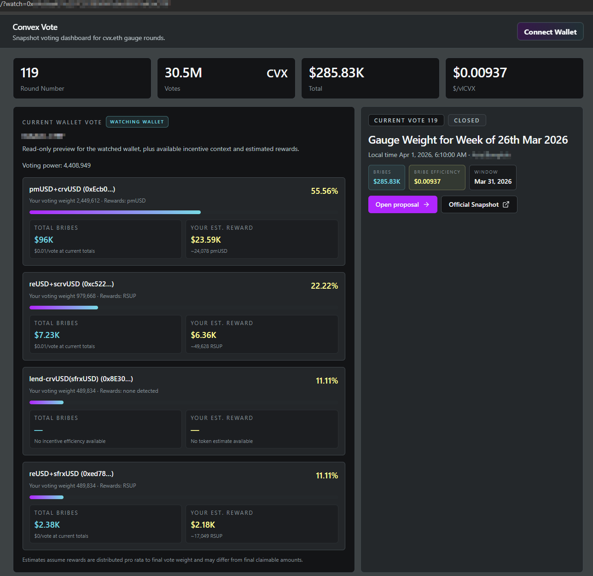
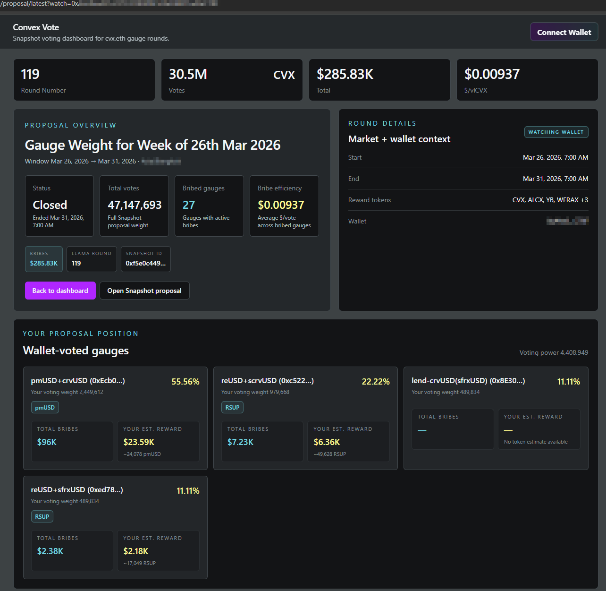

# Convex Vote

**A better way to vote for Convex.**

Convex gauge voting is too important to be hidden behind awkward workflows and hard-to-read data. This project aims to give CVX voters a cleaner interface, better market context, and a wallet-aware view of rewards so everybody can vote with a good UI.

## Recent updates

- v1.0.0: added Votium bribe claiming and in-app Snapshot voting
- v0.1.0: first public release
- deployed on Cloudflare Pages at `https://cvx.ns03.dev`
- added same-origin Llama proxying and first-party Umami analytics support

## What it does

- shows the latest Convex gauge round in a readable dashboard
- highlights your wallet allocations and estimated rewards
- breaks down bribed gauges, reward tokens, and bribe efficiency
- supports read-only wallet watch mode with `?watch=0x...`
- provides a richer proposal page for exploring bribed gauges and your position in the round

## Screenshots

### Home page



### Proposal page



## Project idea

This app is built around a simple belief:

> Convex voters should have a high-quality interface for understanding where votes are going, what rewards are attached, and what their own wallet is doing.

The current product direction is:

- **wallet first** on the home page
- **market view + my position** on the proposal page
- better visibility into gauges, reward tokens, bribes, and expected outcomes

## Status

The app is live at **https://cvx.ns03.dev**.

Production deploys run on Cloudflare Pages with same-origin proxying for Llama Airforce data and first-party analytics forwarding for Umami.

## Local development

```bash
bun install
bun run dev
```

Then open:

- `http://localhost:5173/`
- or watch a wallet with `http://localhost:5173/?watch=0xYourWallet`

## Tech

- React
- Vite
- TypeScript
- Tailwind CSS
- Wagmi / RainbowKit
- Snapshot GraphQL
- Llama Airforce bribe data

## License

MIT
