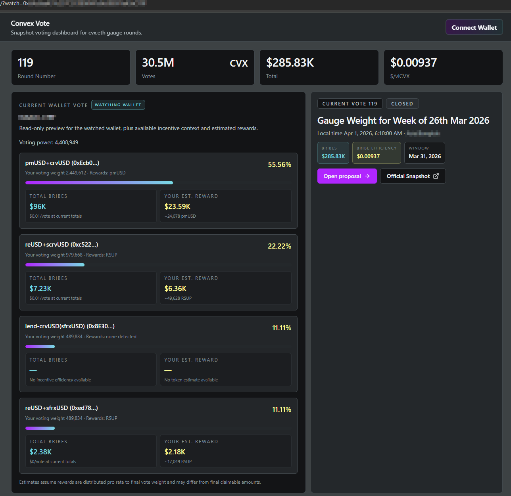
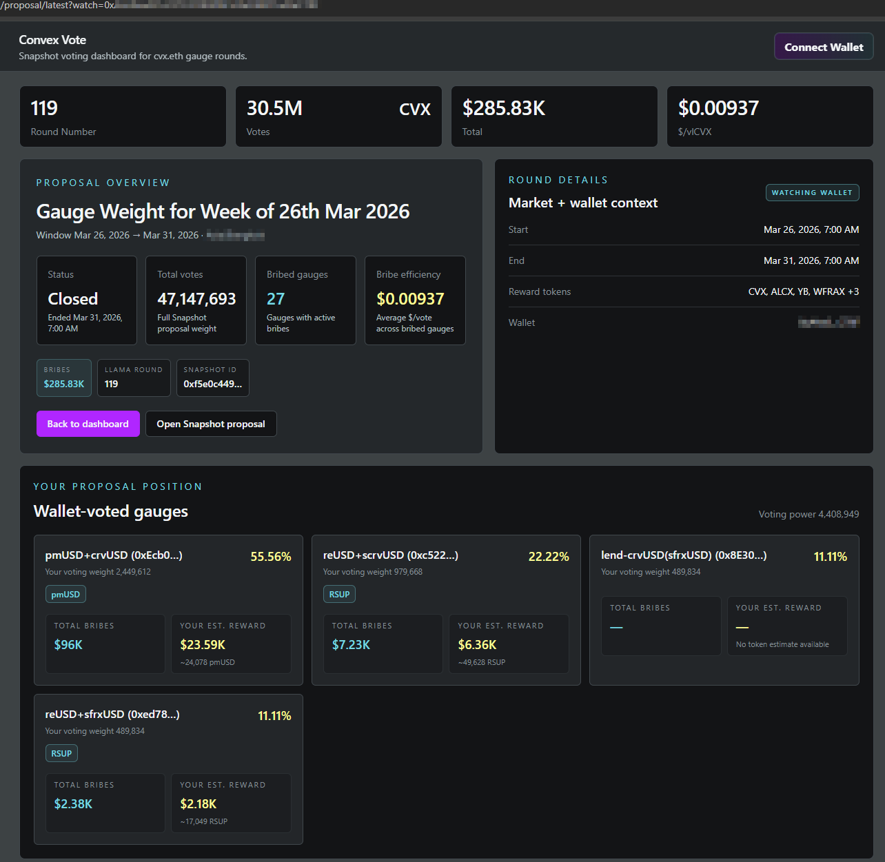

# Convex Vote

**A better way to vote for Convex.**

Convex gauge voting is too important to be hidden behind awkward workflows and hard-to-read data. This project aims to give CVX voters a cleaner interface, better market context, and a wallet-aware view of rewards so everybody can vote with a good UI.

## Recent updates

- v1.0.11: added a resilient between-round state when Convex has no active proposal
- v1.0.10: added direct gauge-card voting with a synchronized ballot and identifier search
- v1.0.9: fixed duplicate-token rendering keys in proposal incentive cards
- v1.0.8: migrated live gauge rounds and voting from Snapshot to Convex's on-chain system
- v1.0.7: tightened mobile proposal and gauge-card spacing
- v1.0.6: added active-round bribe anomaly warnings against the previous Llama round
- v1.0.5: improved proposal polish, watched-wallet validation, and claim readiness handling
- v1.0.4: rolled wagmi back to the RainbowKit-compatible v2 stack for more reliable Rabby mobile connections
- v1.0.3: enabled WalletConnect mobile wallet connections via RainbowKit default config
- v1.0.2: fixed 502 error on claims by bypassing Worker subrequest limits
- v1.0.1: added footer with version info and fixed TypeScript errors
- v1.0.0: added Votium bribe claiming and the first in-app voting flow
- v0.1.0: first public release
- deployed on Cloudflare Pages at `https://cvx.ns03.dev`
- added same-origin Llama proxying and first-party Umami analytics support

## What it does

- shows the latest Convex gauge round in a readable dashboard
- highlights your wallet allocations and estimated rewards
- breaks down bribed gauges, reward tokens, and bribe efficiency
- submits Curve gauge allocations directly to Convex's on-chain vote platform
- supports read-only wallet watch mode with `?watch=0x...`
- provides a richer proposal page for exploring bribed gauges and your position in the round

## Screenshots

### Home page



### Proposal page



## Project idea

This app is built around a simple belief:

> Convex voters should have a high-quality interface for understanding where votes are going, what rewards are attached, and what their own wallet is doing.

The current product direction is:

- **wallet first** on the home page
- **market view + my position** on the proposal page
- better visibility into gauges, reward tokens, bribes, and expected outcomes

## Status

The app is live at **https://cvx.ns03.dev**.

Production deploys run on Cloudflare Pages with same-origin proxying for Convex and Llama Airforce data, plus first-party analytics forwarding for Umami.

## Local development

```bash
bun install
bun run dev
```

Then open:

- `http://localhost:5173/`
- or watch a wallet with `http://localhost:5173/?watch=0xYourWallet`

## Tech

- React
- Vite
- TypeScript
- Tailwind CSS
- Wagmi / RainbowKit
- Convex current-proposal API and gauge voting contracts
- Votium incentive data via Llama Airforce

## License

MIT
